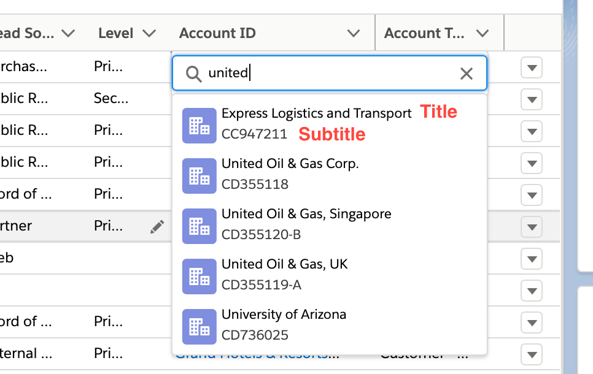
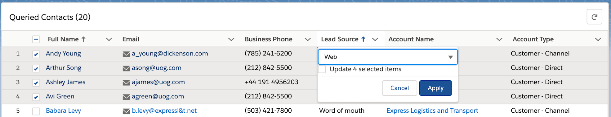
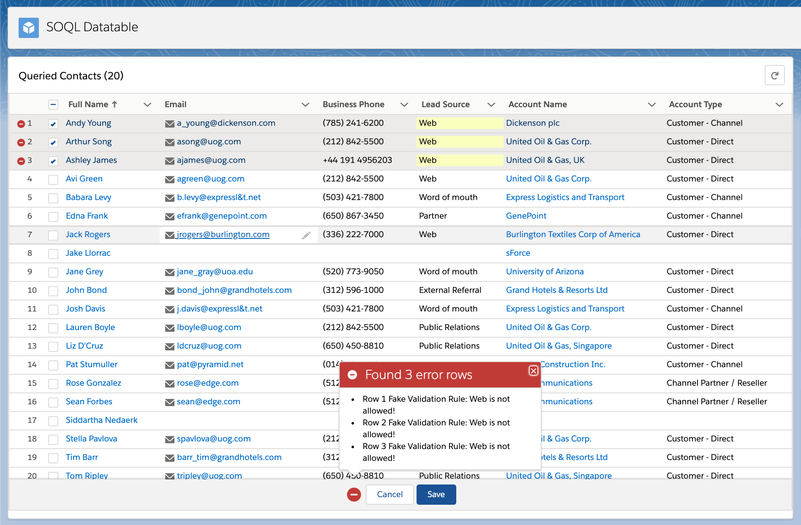
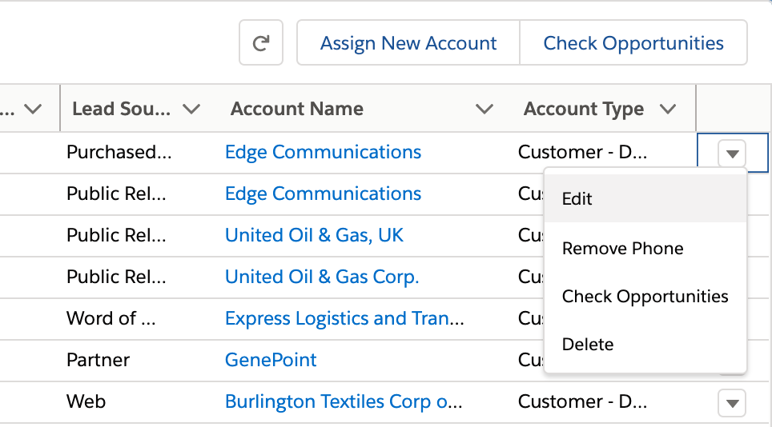
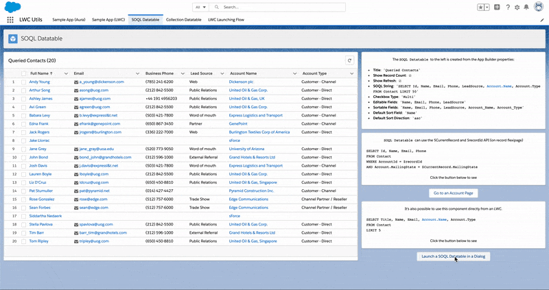
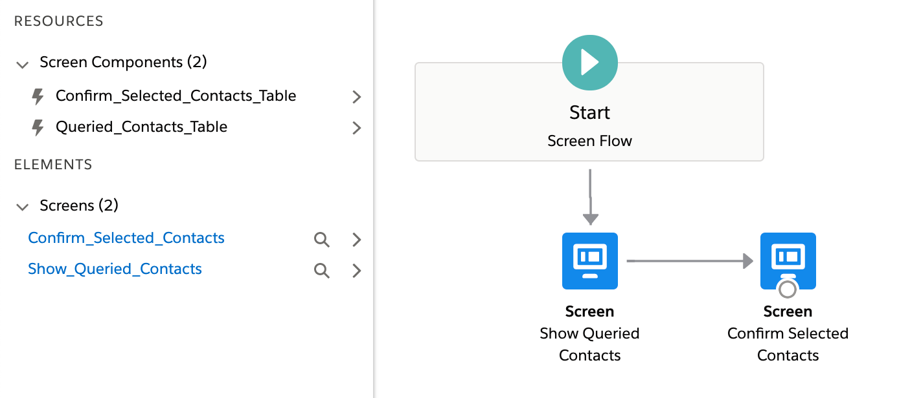
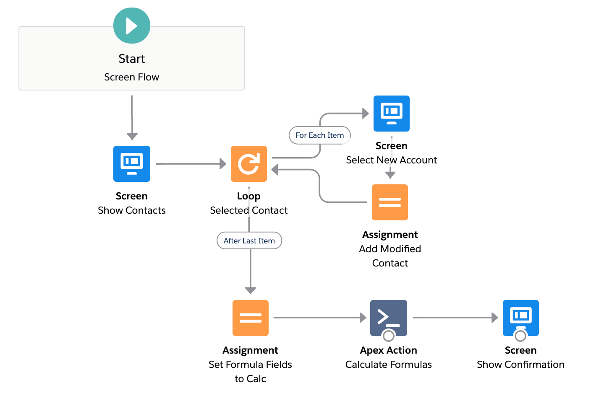

<!-- omit in toc -->
# LWC Utils

Reusable LWCs to 10x your solution building speed.

- `messageService`: Lightning Message Service (LMS) simplified component messaging.
- `SOQL Datatable`: Leverage SOQL to power your list views, related lists, and even Screen Flows.
- `Collection Datatable`: Manage Record Collections variables in Screen Flows.
- Design patterns leveraging both Aura and LWC to dynamically create dialogs (modals) for better UX.
- Launch Screen Flows dynamically inside a dialog (modal) from anywhere.

In this README:

- [Component Library Overview](#component-library-overview)
  - [messageService](#messageservice)
  - [DialogService](#dialogservice)
  - [MessageServiceHandler](#messageservicehandler)
  - [FlowWrapper](#flowwrapper)
  - [dialogAutoCloser](#dialogautocloser)
  - [soqlDatatable](#soqldatatable)
    - [soqlDatatable - Features and Examples](#soqldatatable---features-and-examples)
  - [collectionDatatable](#collectiondatatable)
    - [collectionDatatable - Features and Examples](#collectiondatatable---features-and-examples)
- [Deploy (Unlocked Package)](#deploy-unlocked-package)
  - [LWC Utils](#lwc-utils)
  - [LWC Utils Recipes](#lwc-utils-recipes)
  - [Configuration and Getting Started](#configuration-and-getting-started)

<!-- omit in toc -->
## Introduction

This repo showcases the best defaults for creating rich, interactive, data-dense UIs using the following centerpieces:
- `lightning-datatable` from LWC.
- `lightning:overlayLibrary` from Aura.
- `lightning:flow` from Aura.
- `Lightning Message Service` to stitch it all-together.

Salesforce has invested heavily into `LWC`, `Flow` and `Screen Flow` and has given [Architect Guidance](https://quip.com/HmPvA0tSaqfE) around how to build scalable and flexible solutions now and into the future.

This repo builds on that guidance and pushes data-dense UI design to the next level with highly reusable, highly configurable components. These components have saved me thousands of developer hours and allowed me to pivot on a dime to meet the changing speed of business.

I hope they will help you do the same.

## Component Library Overview

| Component Name                                                                                                                   | Description                                                                                                                                                                                                                                                                                                                                                                          | Component Type                                                              |
| -------------------------------------------------------------------------------------------------------------------------------- | ------------------------------------------------------------------------------------------------------------------------------------------------------------------------------------------------------------------------------------------------------------------------------------------------------------------------------------------------------------------------------------ | --------------------------------------------------------------------------- |
| `messageService`<br><br>[Example](#messageService)<br>[Code](./utils-core/main/default/lwc/messageService/messageService.js#L41) | Use one API to communicate **within** or **across** both Aura and LWC technologies.<br><br>Use this component instead of manually publishing / subscribing to `Lightning Message Service` (LMS).<br><br>Provides a psuedo-namespacing property called `boundary` which can separate subscribers by string, `recordId` etc.                                                           | LWC:<br>- Service                                                           |
| `DialogService`<br><br>[Example](#DialogService)<br>[Code](./utils-core/main/default/aura/DialogService)                         | Provide LWCs access to `lightning:overlayLibrary` to create dialogs (modals) via LMS.<br><br>Both Aura and LWCs can be created dynamically and injected as the dialog body.<br><br>Both Aura's public `attributes` and LWC's `@api` properties can be passed in.                                                                                                                     | Aura:<br>- Service                                                          |
| `MessageServiceHandler`<br><br>[Example](#MessageServiceHandler)<br>[Code](./utils-core/main/default/aura/MessageServiceHandler) | Provides access to `DialogService` by handling the `opendialog` LMS event.<br><br>This is a hidden component you need to place on the flexipage or utility bar (hidden, empty label).                                                                                                                                                                                                | Aura:<br>- Service<br>- Utility Bar <br>- Record Flexipage                  |
| `EventFooter`<br><br>[Code](./utils-core/main/default/aura/EventFooter)                                                          | Dynamic footer for lwc dialogs. Meant to be used by `DialogService`.<br><br>Contains an instance of `messageService` listening for the `closedialog` LMS Event.<br><br>Unfortunately, `component.getReference()` does not work on LWCs. Write your own action button in the dialog body.                                                                                             | Aura:<br>- Service                                                          |
| `ModalFooter`<br><br>[Code](./utils-core/main/default/aura/ModalFooter)                                                          | Dynamic footer for aura dialogs. Meant to be used by `DialogService`.<br><br>Connects a primary action on the target dialog body to the footer's main action via `component.getReference()`<br><br>Enables writing functions directly on the dialog body and `DialogService.modal()` will connect it to a primary action.                                                            | Aura:<br>- Service                                                          |
| `FlowWrapper`<br><br>[Example](#FlowWrapper)<br>[Code](./utils-core/main/default/aura/FlowWrapper)                               | Helps with dynamic flow creation, for example, inside a dialog body created from `DialogService`.<br><br>Can be used with `dialogAutoCloser` on the final screen to automatically close a Flow.<br><br>See [`flowWizardLauncherExample`](./utils-core/main/default/lwc/flowWizardLauncherExample/flowWizardLauncherExample.js#L19)                                                   | Aura:<br>- Service                                                          |
| `dialogAutoCloser`<br><br>[Example](#dialogAutoCloser)<br>[Code](./utils-core/main/default/lwc/dialogAutoCloser)                 | Contains a progress bar and timer message (optional).<br><br>Automatically publishes a `closedialog` LMS event and bubbles the same `closedialog` Custom Event when timer hits 0.<br><br>Use `uniqueBoundary` to target a specific dialog to close if [Tab-Focused Dialogs is Enabled](https://releasenotes.docs.salesforce.com/en-us/winter20/release-notes/rn_console_dialogs.htm) | LWC:<br>- Service<br>- Flow Screen                                          |
| `soqlDatatable`<br><br>[Example](#soqlDatatable)<br>[Code](./utils-core/main/default/lwc/soqlDatatable)                          | A SOQL powered list view. <br><br>Meant to replace any related list / list view.<br><br>Supports record context, in-line editing, configurable table/row actions, output of selected rows to Flow (or other LWCs) and more.<br><br>See example for full features.                                                                                                                    | LWC:<br>- Service<br>- App Flexipage<br>- Record Flexipage<br>- Flow Screen |
| `collectionDatatable`<br><br>[Example](#collectionDatatable)<br>[Code](./utils-core/main/default/lwc/collectionDatatable)        | Display Record Collections inside Flow Screens.<br><br>Meant to mimic a related list / list view.<br><br>Can be populated from a Flow's `Get Records` or `soqlDatatable.selectedRows` output.                                                                                                                                                                                        | LWC:<br>- Flow Screen                                                       |
### messageService

Designed to ease the friction of inter-component (and technology) communication. This component is both the publisher and the subscriber to reduce implementation friction.

With that design, it's important to leverage the `boundary` property to properly scope your event publisher/listeners.

Some components in this library, like `soqlDatatable`, will generate a UUID to help scope payloads to its own child components (custom data type cells, dialogs etc).

This component uses `Lightning Message Service` on `OpenChannel__c` to message `payloads` in a `key` / `value` format as defined in `OpenChannel__c` like this:

```js
const payload = {
    key: 'coolevent',
    value: {
        hello: 'world',
        foo: 'bar'
    }
}
this._messageService.publish(payload);

// or, my preferred method, this way

const payload = {
    accountId: '12345'
}
this._messageService.publish({key: 'supercoolevent', value: payload});
```

And handled like this, composed on the template:

```html
<c-message-service
    boundary="sample_app_lwc"
    oncoolevent={handleCoolEvent}
    onsupercoolevent={handleSuperCoolEvent}
></c-message-service>
```
```js
handleCoolEvent(event) {
    console.log(event.detail.value.hello) // world
    console.log(event.detail.value.foo) // bar
}

handleSuperCoolEvent(event) {
    const payload = event.detail.value
    console.log(payload.accountId) // 12345
}
```

This component doesn't need to subscribe to an event, it can be used for publish only:

```html
<!-- No listeners, but has a boundary set for any publish() calls -->
<c-message-service boundary={recordId}></c-message-service>

... or

<!-- No listeners, no boundary set for any publish() calls -->
<c-message-service></c-message-service>
```

This component also provides public methods to Aura only APIs like `overlayLibrary`.

For example, using `.dialogService()` ultimately routes to `DialogService.cmp`:

```js
const dialogServicePayload = {
    method: 'bodyModalLarge',
    config: {
        auraId: 'soql-datatable-example',
        headerLabel: 'Dynamically Created SOQL Datatable',
        component: 'c:soqlDatatable',
        componentParams: {
            isRecordBind: false,
            recordId: this.recordId,
            queryString: query
        }
    }
};
this._messageService.dialogService(dialogServicePayload);
```

<details>
    <summary>messageService Specification</summary>

⠀

**Attributes**

| name     | type   | access | required | default | description                                                                                                                                                                                                                                                                                                                                                                                |
| -------- | ------ | ------ | -------- | ------- | ------------------------------------------------------------------------------------------------------------------------------------------------------------------------------------------------------------------------------------------------------------------------------------------------------------------------------------------------------------------------------------------ |
| boundary | string | public | no       |         | Filter subscription messages like a namespace.<br><br>e.g. `recordId` if you only want same components on same record flexipage to handle the publish.<br><br>e.g. `sample_app_lwc` as reference among various components that share the same functionality.<br><br>Enablement of `APPLICATION_SCOPE` like in [this diagram](/readme-images/rn_lc_lms_scope.png) is not currently enabled. |

**Public Methods**

| name              | arguments                   | description                                                                                                                                                                                                                                                                                                                                                                                                                                   |
| ----------------- | --------------------------- | --------------------------------------------------------------------------------------------------------------------------------------------------------------------------------------------------------------------------------------------------------------------------------------------------------------------------------------------------------------------------------------------------------------------------------------------- |
| dialogService     | (`payload`)                 | `payload` is in the shape required by `MessageServiceHandler`. Examples:<br>[`flowWizardLauncherExample`](./utils-core/main/default/lwc/flowWizardLauncherExample/flowWizardLauncherExample.js#L18)<br>[`lwcContactDatatable`](./utils-core/main/default/lwc/lwcContactDatatable/lwcContactDatatable.js#L73)<br>[`soqlDatatableLauncherExample`](./utils-core/main/default/lwc/soqlDatatableLauncherExample/soqlDatatableLauncherExample.js#L12) |
| notifyClose       |                             | Uses `publishOpen` to fire a `closedialog` LMS Event which will close any dialog opened by `DialogService`                                                                                                                                                                                                                                                                                                                                    |
| publish           | (`payload`)                 | Leverages LMS's `publish` functionality.<br>Defaults to no `boundary`.<br>If `boundary` is set, all subscribers will require the same `boundary`.                                                                                                                                                                                                                                                                                             |
| publishOpen       | (`payload`)                 | Leverage LMS's `publish` functionality without `boundary`. Any subscriber can react to this event.<br>// TODO Useful for `closedialog` unless this [critical update](https://releasenotes.docs.salesforce.com/en-us/winter20/release-notes/rn_console_dialogs.htm) is enabled.<br>// TODO When a user can simultaneously open multiple dialogs in service console, it's better to set a `boundary`.                                           |
| forceRefreshView  |                             | Uses `eval("$A.get('e.force:refreshView').fire();");` directly.                                                                                                                                                                                                                                                                                                                                                                               |
| notifySuccess     | (`title`, `message` = null) | Convenience function for `ShowToastEvent`                                                                                                                                                                                                                                                                                                                                                                                                     |
| notifyInfo        | (`title`, `message` = null) | Convenience function for `ShowToastEvent`                                                                                                                                                                                                                                                                                                                                                                                                     |
| notifySingleError | (`title`, `error` = '')     | Convenience function for `ShowToastEvent`.<br>`error` object can be passed directly in, it will be reduced/parsed by `c-utils.reduceError`.                                                                                                                                                                                                                                                                                                   |
</details>

### DialogService

This component is composed inside `MessageServiceHandler` and provides it with the public methods for creating modals via Aura's `overlayLibrary`.

Primarily used by `messageService` for message publishing, `MessageServiceHandler` receives the subscription and delegates to this component.

It is not recommended to use this component directly.

<details>
    <summary>DialogService Specification</summary>

⠀

**Attributes**

| name           | type   | access | required | default | description                                                                                                                     |
| -------------- | ------ | ------ | -------- | ------- | ------------------------------------------------------------------------------------------------------------------------------- |
| overlayPromise | Object | public | no       |         | Stores the returned overlay promise from `overlayLibrary`.<br><br>If a `callback` is specified by the caller, this is returned. |

**Public Methods**

Arguments for this component are not in JS Object `{}` notation so that they can be explicitly listed out in the component itself.

For that reason, it is recommended to use `messageService` / `MessageServiceHandler` to call these functions.

| name           | arguments                                                                                                                                                                 | description                                                                                                                                                                                                                                                                                                                                                                                                                                                                                                                                                                                                                                                                                |
| -------------- | ------------------------------------------------------------------------------------------------------------------------------------------------------------------------- | ------------------------------------------------------------------------------------------------------------------------------------------------------------------------------------------------------------------------------------------------------------------------------------------------------------------------------------------------------------------------------------------------------------------------------------------------------------------------------------------------------------------------------------------------------------------------------------------------------------------------------------------------------------------------------------------ |
| showPopover    | (<br>  `body`,<br>  `bodyParams`,<br>  `referenceSelector`,<br>  `cssClass`,<br>  `callback`<br>)                                                                         | No examples for this one yet.                                                                                                                                                                                                                                                                                                                                                                                                                                                                                                                                                                                                                                                              |
| modal          | (<br>  `auraId`,<br>  `headerLabel`,<br>  `body`,<br>  `bodyParams`,<br>  `mainActionReference`,<br>  `mainActionLabel`,<br>  `callback`,<br>)                            | Compatible with Aura dialog bodies.<br><br>`body` is the component name (Aura notation) to be created in a dialog.<br><br>`bodyParams` are public attributes to be passed from the caller to the body.<br><br>`mainActionReference` uses `component.getReference` to connect the primary action in `ModalFooter` to a function on the body to be created.<br>This allows you to avoid writing a button specifically at the bottom of the body to be created.<br><br>`mainActionLabel` changes the label of the primary action on `ModalFooter`.<br><br>`callback` is optionally specified to return the `overlayPromise` if needed. Alternatively, listen for the `dialogready` LMS Event. |
| modalLarge     | (<br>  `auraId`,<br>  `headerLabel`,<br>  `body`,<br>  `bodyParams`,<br>  `mainActionReference`,<br>  `mainActionLabel`,<br>  `callback`,<br>  `isLargeModal = true`<br>) | Compatible with Aura dialog bodies.<br><br>Same as `modal`, with wider dialog box using `slds-modal_large`                                                                                                                                                                                                                                                                                                                                                                                                                                                                                                                                                                                 |
| bodyModal      | (<br>  `auraId`,<br>  `headerLabel`,<br>  `body`,<br>  `bodyParams`,<br>  `callback`<br>)                                                                                 | Compatible with LWC dialog bodies.<br><br>Same as `modal` except without connectivity to a `mainAction` via `component.getReference` which doesn't work on LWCs, even with `@api` functions.<br><br>Instead, a slim footer called `EventFooter` is created which is subscribing to the `dialogclose` event for closing the dialog.<br><br>Write your own `Cancel` and `Primary Action` button on the dialog body that is dynamically being created.                                                                                                                                                                                                                                        |
| bodyModalLarge | (<br>  `auraId`,<br>  `headerLabel`,<br>  `body`,<br>  `bodyParams`,<br>  `callback`,<br>  `isLargeModal = true`<br>)                                                     | Compatible with LWC dialog bodies.<br><br>Same as `bodyModal`, with wider dialog box using `slds-modal_large`                                                                                                                                                                                                                                                                                                                                                                                                                                                                                                                                                                              |
</details>

### MessageServiceHandler

As of early Summer 20, `Lightning Message Service` requires rendering on the DOM to be connected.

Because of this limitation, this component is designed to be placed once on the utility bar (rendered, but hidden label) OR per flexipage.

The primary use case for this component is to parse the `messageService.dialogService()` payload. It expects two properties:

```js
const flowOrDialogServicePayload = {
    method: 'bodyModal', // or bodyModalLarge, flowModal, flowModalLarge
    config: {
        <see flowWizardLauncherExample>
        <or soqlDatatableLauncherExample>
    }
}
```

This component is very simple which just listens and delegates to `DialogService`.

It can easily be extended to include other Aura only APIs, such as `lightning:workspaceAPI`.

```html
<aura:component implements="lightning:utilityItem">
    <c:DialogService aura:id="dialogService" />
    <c:messageService aura:id="messageService" onopendialog="{! c.handleDialogService }" />
    <c:singleton aura:id="singleton" />
</aura:component>
```

<details>
    <summary>MessageServiceHandler Specification</summary>

⠀

**Attributes**

None

**Public Methods**

None

</details>

### FlowWrapper

This component is designed to help launch flows dynamically, from any LWC click event.

This powers configurable flow actions (table and row) on `soqlDatatable` by being dynamically created inside a dialog.

The component itself is very simple, as it's meant to be called via `DialogService` which creates an instance of it:

```js
// DialogService.executeDialogService()
...

    if (payload.method.startsWith('flow')) {
        flowModalConfig = {
            auraId: 'flow-wizard-container',
            headerLabel: payload.config.flowHeaderLabel,
            component: 'c:FlowWrapper',
            componentParams: {
                flowApiName: payload.config.componentParams.flowApiName,
                inputVariables: payload.config.componentParams.inputVariables
            }
        };
    }

...
```

```html
<aura:component>
    <c:messageService aura:id="messageService" />
    <aura:attribute name="flowApiName" type="String" access="PUBLIC" />
    <aura:attribute name="inputVariables" type="Object[]" access="PUBLIC" />
    <aura:handler name="init" value="{! this }" action="{! c.doInit }" />
    <div class="slds-is-relative">
        <lightning:flow aura:id="flow" onstatuschange="{! c.handleStatusChange }" />
    </div>
</aura:component>
```

<details>
    <summary>FlowWrapper Specification</summary>

⠀

**Attributes**

| name           | type     | access | required | default | description                                                                                           |
| -------------- | -------- | ------ | -------- | ------- | ----------------------------------------------------------------------------------------------------- |
| flowApiName    | String   | public | yes      |         | Developer Name of the flow to be dynamically created by `lightning:flow`                              |
| inputVariables | Object[] | public | yes      |         | Array of inputs in flow's `[{ name: 'flowVarName', type: 'String', value: 'my cool string value!' }]` |

**Public Methods**

None

</details>

### dialogAutoCloser

A simple component that counts down and auto closes a `DialogService` opened dialog by sending a `messageService` connected `closedialog` event.

This is meant to be used with `DialogService` when launching a Screen Flow as the final step.

However, there are a couple more ways to use it:

- As a visual countdown progress bar, handling the bubbled `closedialog` Custom Event by yourself.
- Refreshing an instance of `soqlDatatable` by using the `uniqueBoundary` and `isRefreshTable` properties.
    - This sends a `boundary` scoped: `refreshsoqldatatable` LMS event.

> **NOTE**: It is recommended you provide this component a `uniqueBoundary` scoped to its caller, otherwise it may close more dialogs than intended if [Tab-Focused Dialogs](https://releasenotes.docs.salesforce.com/en-us/winter20/release-notes/rn_console_dialogs.htm) is enabled.

```html
<template>
    <c-message-service></c-message-service>
    <lightning-layout horizontal-align="center" multiple-rows>
        <lightning-layout-item flexibility="shrink">
            {messageTemplate}
        </lightning-layout-item>
        <lightning-layout-item size="12">
            <lightning-progress-bar value={progress}></lightning-progress-bar>
        </lightning-layout-item>
    </lightning-layout>
</template>
```

```js
    @api messageTemplate = 'Auto closing in {timer} seconds';
    @api timer = 5;

    ...

    renderedCallback() {
        if (this._isRendered) {
            return;
        }
        this._isRendered = true;
        this._startProgressInterval();
        this._startTimerInterval();
    }
```

<details>
    <summary>dialogAutoCloser Specification</summary>

⠀

**Attributes**

| name            | type   | access | required | default                         | description                                                      |
| --------------- | ------ | ------ | -------- | ------------------------------- | ---------------------------------------------------------------- |
| messageTemplate | String | public | no       | Auto closing in {timer} seconds | Message to display to user while countdown is running            |
| timer           | Number | public | no       | 5                               | Seconds until the component launches the `closedialog` LMS event |

**Public Methods**

None
</details>

### soqlDatatable

Create a fully featured `lightning-datatable` with just a SOQL String.

This component can be used on a Flexipage as a list view or a related list. This can even be used inside Screen Flows.

Since this is built on top of the `lightning-datatable` base component, all the bells and whistles can be inherited.

The below example showcases how easy it is to create a `soqlDatatable` right in the Lightning App Builder with the following query string:

```
SELECT Name, Email, Phone, LeadSource, Level__c, AccountId, Account.Type FROM Contact LIMIT 50
```


#### soqlDatatable - Features and Examples

<!-- Psuedo-spoiler tags can be formed like this. Line break is required! -->
<details>
    <summary>Using Record Context with <code>$CurrentRecord</code> in the SOQL</summary>

⠀

`$CurrentRecord` and `$recordId` are special syntax that allows for merge-fields of current record data into the SOQL string. By using them, you can merge current record context as values in the `WHERE` clause as follows:

```js
// Find other Accounts similar to this Account's Industry
SELECT Name, Type, Website, Industry
FROM Account
WHERE Industry = $CurrentRecord.Industry
AND Id != $recordId

// Find related contacts with same MailingState as this Account's BillingState
SELECT Name, Email, MailingState, Account.BillingState
FROM Contact
WHERE AccountId = $recordId
AND MailingState = $CurrentRecord.BillingState
```

This uses Lightning Data Service (`getRecord`) to retrieve and resolve the record values, so make sure your user(s) have FLS enabled for any fields you plan on using the `$CurrentRecord` feature with.

All data types that can be SOQL-ed are supported for `$CurrentRecord`.

Please submit issues to this repo if you find one that cannot be merged correctly.
</details>

<details>
    <summary>Row Selection Events and Flow outputs</summary>

⠀

When this component's `checkboxType` is configured to `Multi` or `Single`, the base `datatable` emits a `rowselection` event which can be handled by any parent LWC:

```js
// datatable.js
case 'rowselection': {
    this.dispatchEvent(
        new CustomEvent('rowselection', {
            detail: { selectedRows: this.selectedRows },
            bubbles: true,
            composed: true
        })
    );
    break;
}
```
```html
<c-soql-datatable
    ...
    onrowselection={handleRowSelection}
    ...
></c-soql-datatable>
```
```js
handleRowSelection(event) {
    console.log(event.detail.selectedRows); // this.selectedRows from base datatable.js
}
```

This component also outputs `selectedRows` and `firstSelectedRow` to Flow screens as output variables. See the specification section for details.
</details>

<details>
    <summary>Inline / Mass Inline Editing</summary>

⠀

Define which fields can be editable in a comma separated list in the `Editable Fields` design attribute. For data types that are supported in the vanilla `lightning-datatable`, such as `date`, `text`, `number`, those are relied on as heavily as possible.

> **Note**: All edits on `save` will be saved to database using Lightning Data Service `updateRecords`. Errors will be handled using `lightning-datatable` formatted error handling.

For data types such as `picklist` and `lookup` which are yet to be [supported](https://trailblazer.salesforce.com/ideaView?id=0873A000000PZJ4QAO), this component provides custom data types as follows.

**Picklist Custom Data Type**

This custom data type is surfaced as `customPicklist`. It always places a `--None--` value, regardless of if your picklist is configured to always require a value. The save will fail and user will need to correct it to move on.

`RecordType` restricted picklist values are supported with a limitation:

> When using mass edit on a Picklist field for a Standard Object enabled with Record Types, it's possible to mass apply a value which does not belong on that table. This seems to be because Standard Object picklist fields do not have the `Restrict picklist to the values defined in the value set` option.

The actual picklist edit cell is a fork of the one authored by jlyon87 as found [here](https://github.com/jlyon87/lwc-picklist)

**Lookup Custom Data Type**

The custom LWC data type is surfaced as `customLookup`.

Each `soqlDatatable` can be have one defined **Lookup Configuration** (`Datatable_Config__mdt`) to define lookup search behavior.

Because of a limitation with cmdt, the `Type__c` on the parent `Datatable_Config__mdt` must be `Lookups`.

When using inline edit and lookup, there are two properties that are set as global defaults on `Datatable_Lookup_Config__mdt` that help with the search results:

- **Title**: Name of the Record
- **Subtitle**: null

However, in this sample repo, they are overridden by the following settings:


Which produces this kind of search result:

<p align="center">
    
</p>

The actual lookup edit cell is a fork of the one authored by jlyon87 as found [here](https://github.com/jlyon87/lwc-lookup)

**Supported Features for all Custom Data Types**
- Multi-line inline edit (aka mass-edit).

<p align="center">
    
</p>

- Partial save across rows is supported.
    - Error display user experience is aligned to **native list views**.
    - If one row errors, all fields/columns for that row fail as well until all errors are resolved.

<p align="center">
    
</p>

**Unsupported / Roadmap Features**
- Keyboard navigation.
    - Pending lwc / aura issue investigation [here](https://github.com/salesforce/lwc/issues/1962).
- Geolocation fields must be queried with the `__Longitude__s` and `__Latitude__s` (capital L).
- Time data type is not yet supported for **view** or **edit**.

</details>

<details id="soql-datatable---custom-column-labels">
    <summary>Custom Column Labels</summary>


Define custom labels for any column selected. To override, provide a comma-separated list using the `columnLabels` metadata property. Notation uses the Apex Map class's fat arrow notation (`=>`) for mapping the API Name to your new label: `fieldApiName1=>newLabel, fieldApiName2=>new label with spaces 2`. By default, the Label for the Field API Name in question is used. Custom labels are trimmed before being displayed, thus all four of the below are valid ways to supply labels:

- `fieldApiName1 =>newLabel`
- `fieldApiName1 => newLabel`
- `fieldApiName1=> newLabel`
- `fieldApiName1=>newLabel`

</details>

<details>
    <summary>Column Sorting</summary>

⠀

Add a list of Field API names to the `sortableFields` property to enable this feature. Parent notation (one level up) is supported.

Optionally, set default `Sort Field` and `Sort Direction` to have the asc/desc indicator automatically show when the table is initialized.

Multi-sort and filtering will not be supported.

Global search is [on the roadmap (like regular list views)](https://github.com/tsalb/lwc-utils/issues/9)
</details>

<details>
    <summary>Configurable Flow and LWC actions</summary>

⠀
>**Important Note**: There is additional config needed to make Configurable actions work. Please see the [getting started](https://github.com/tsalb/lwc-utils#configuration-and-getting-started) section of the README.

Each `soqlDatatable` can be have one defined **Action Configuration** (`Datatable_Config__mdt`) to define both Table level (supporting multi / single select) and Row Level actions. This can be the same `Datatable_Config__mdt` as used in the **Lookup Configuration** section.

Because of a limitation with cmdt, the `Type__c` on the parent `Datatable_Config__mdt` must be text of `Actions`. For combined configs, use `Actions; Lookups`.

Both LWCs (inside a dialog) and Screen Flows can be launched from either action type. The configuration is easier to explain in picture format:


<p align="center">
    
</p>

**Assign New Account - Flow Table Action**

The button is configured to the `SOQL_Datatable_Flow_Action_Update_Contacts_with_New_Account` Screen Flow.

`soqlDatatable` sends the following `inputVariables` to Flows.

All of the following **must** be implemented as variables if the Screen Flow backs an action, otherwise you will get an error.

| Name             | Type      | Value                                                                    |
| ---------------- | --------- | ------------------------------------------------------------------------ |
| SelectedRows     | SObject[] | Choose the correct Object type in a Record Collection.                   |
| FirstSelectedRow | SObject   | First Selected Row, choose the correct Object in a Record variable.      |
| UniqueBoundary   | String    | For `dialogAutoCloser` to refresh the table that opened the Screen Flow. |
| SourceRecordId   | String    | The recordId of the page that the `soqlDatatable` is placed on.          |

When the flow is done, it auto-closes using `dialogAutoCloser`.


> **Note:** Due to how data is constructed in `soqlDatatable`, you cannot use the `SelectedRows` directly in a `Update Records`. Always assign values you specifically want to update to a new Record Variable that is **not** an output of `soqlDatatable`, which in this example is `ContactShell`/`ContactToUpdate`.

**Check Opportunities - LWC Table Action**

This button configured to open the `checkOpportunitiesExample` LWC.

Notice the public attributes, these are always supplied by `soqlDatatable` when invoking an LWC.

```html
<template>
    <c-message-service boundary={uniqueBoundary}></c-message-service>
    <template if:true={queryString}>
        <c-soql-datatable query-string={queryString}></c-soql-datatable>
    </template>
    <template if:false={queryString}>
        <div class="slds-align_absolute-center">
            No Contacts Selected. Please choose contacts to view opportunities for.
        </div>
    </template>
</template>
```
```js
...

@api uniqueBoundary;
@api selectedRows;
@api sourceRecordId;

queryString;

// private
_isRendered;
_messageService;
_accountIdSet = new Set();

connectedCallback() {
    if (this.selectedRows && this.selectedRows.length) {
        this.selectedRows.forEach(row => {
            this._accountIdSet.add(`'${row.AccountId}'`);
        });
    }
    if (this._accountIdSet.size > 0) {
        let accountIds = Array.from(this._accountIdSet.keys());
        this.queryString = convertToSingleLineString`
            SELECT Account.Name, Name, Amount, CloseDate, StageName
            FROM Opportunity
            WHERE AccountId IN (${accountIds.join(',')})
            ORDER BY Account.Name ASC
        `;
    }
}

...
```

**Remove Phone - Flow Row Action**

The button is configured to the `SOQL_Datatable_Flow_Row_Action_Remove_Contact_Phone` Screen Flow.

This Screen Flow also auto-closes with `dialogAutoCloser`.


> **Note:** Due to how data is constructed in `soqlDatatable`, you cannot use the `FirstSelectedRecord` directly in an `Update Records`. Always assign values you specifically want to update to a new Record Variable that is **not** an output of `soqlDatatable`, which in this example is `ContactToUpdate`.

</details>

<details>
    <summary>Dynamic Creation via MessageService & DialogService</summary>

⠀

Dynamically create a `soqlDatatable` when clicking the `Launch a SOQL Datatable in a Dialog` button.

<p align="center">
    
</p>

This is the psuedo-code of what happens:

```
button.js calls messageService.dialogService(payload)
    => button.js composed instance of messageService uses LMS to...
        => Another composed instance of messageService in MessageServiceHandler.cmp (label-less in utility bar)
            =>  CustomEvent opendialog is bubbled and handled in...
                => MessageServiceHandler.cmp component.finds()...
                    => DialogService.cmp
                        => DialogServiceController.js
                            => $A.createComponent('c:soqlDatatable')
                                => lightning:overlayLibrary
```

Here's the actual payload used in the above code flow:

```js
handleOpenDialog() {
    const query = convertToSingleLineString`
        SELECT Title, Name, Email, Account.Name, Account.Type
        FROM Contact
        LIMIT 5
    `;
    const dialogServicePayload = {
        method: 'bodyModalLarge',
        config: {
            auraId: 'soql-datatable-example',
            headerLabel: 'Dynamically Created SOQL Datatable',
            component: 'c:soqlDatatable',
            componentParams: {
                isRecordBind: false,
                recordId: this.recordId,
                queryString: query
            }
        }
    };
    this._messageService.dialogService(dialogServicePayload);
}
```

As you can see, it's possible to parameterize a payload back to Aura's `$A.createComponent` API to instantiate a public properties against an LWC.
</details>

<details>
    <summary>Support for Aggregate Queries</summary>


You can make use of valid aggregate queries to create dynamic rollup summaries, particularly when combined with the power of the `$recordId` bind variable on record flexipages, like showing a quick snapshot of Opportunity values:


soqlDatatable supports the following aggregate query methods:

- avg
- count
- count_distinct
- min
- max
- sum

The _only_ aggregate query operation not supported is the raw `count` call (without a field API name specified), as this kind of query returns a number instead of `AggregateResult` SObjects:

```sql
--returns an integer
SELECT Count()
FROM User
WHERE Profile.Name = 'Standard User'
```

Invalid SOQL queries will be reported via toast message on the page the soqlDatatable is on.

**Aggregate Query Considerations**

- Aliases do not support spaces or dashes. Use underscores if needed (e.g. `SUM(ExpectedRevenue) Revenue_Sum`).
- `LIMIT` clauses are not supported in aggregate queries without a `GROUP BY` clause.
- You can alias column labels the same way that you can in SOQL: either with a space or without a space. `avg(Id)myAvg` and `avg(Id) myAvg` thus are both labeled `myAvg` within your datatable.
- Non-aliased aggregate fields would typically be returned as `expr0`, `expr1`, etc — instead, we swap out these `expr` labels for the aggregate query in question: e.g. `avg(Id)` is labeled `avg(Id)` within your datatable.
- [Date Functions](https://developer.salesforce.com/docs/atlas.en-us.soql_sosl.meta/soql_sosl/sforce_api_calls_soql_select_date_functions.htm) are supported.

 **Aggregate Query Limitations**

 These may be on the roadmap to fix, but for now please be aware of:

 - Using max/min with any `Date` or `DateTime` field does not currently display properly.


</details>

<details>
    <summary>soqlDatatable Specification</summary>


**Attributes**

| name                 | type      | access | required | default | description                                                                                                                                                                                             |
| -------------------- | --------- | ------ | -------- | ------- | ------------------------------------------------------------------------------------------------------------------------------------------------------------------------------------------------------- |
| isRecordBind         | Boolean   | public |          | true    | Only on Record Page. Use $CurrentRecord or $recordId in your SOQL query to use record context. User must have FLS access.                                                                               |
| title                | String    | public | no       |         |                                                                                                                                                                                                         |
| showRecordCount      | Boolean   | public |          | false   |                                                                                                                                                                                                         |
| showRefreshButton    | Boolean   | public |          | false   |                                                                                                                                                                                                         |
| queryString          | String    | public | yes      |         | Order of fields in the SOQL string determine order of columns. Parent (one level) relationships supported (e.g. Account.Type)                                                                           |
| checkboxType         | String    | public | no       | None    | None, Multi, or Single (outputs radios). This allows the component to emit the `rowselection` event.<br><br>For Screen Flows this populates the `selectedRows` and `firstSelectedRow` output variables. |
| editableFields       | String[]  | public | no       |         | Comma separated list of Field API names for inline editing. Does not support parent relationship (Account.Type). Saving writes to server.                                                               |
| columnLabels       | String[]  | public | no       |         | Comma separated list of Field API names mapped to a custom label using Apex Map kvp syntax: `fieldApiName=>new custom label`.                                                          |
| sortableFields       | String[]  | public | no       |         | Comma separated list of Field API names. Parent relationship is supported (e.g. Account.Type).                                                                                                          |
| sortedBy             | String    | public | no       |         | Single Field API Name. Parent relationship is supported (e.g. Account.Type).                                                                                                                            |
| sortedDirection      | String    | public | no       | asc     |                                                                                                                                                                                                         |
| actionConfigDevName  | String    | public | no       |         | Not available on Flow Screen. Configure table and row actions with a record in `Datatable_Config__mdt`.                                                                                                 |
| lookupConfigDevName  | String    | public | no       |         | Not available on Flow Screen. Configure inline edit lookup search behavior with a record in `Datatable_Config__mdt`.                                                                                    |
| useRelativeMaxHeight | Boolean   | public |          | false   | Force table height to 60% of the vertical screen space. Set to `true` and override with `customRelativeMaxHeight` when appropriate                                                                                                                     |
| customRelativeMaxHeight | String   | public |          |    | Use in conjunction with `useRelativeMaxHeight` to specify a custom percentage (relative to screen size) height for the component.                                                                                                                                                 |
| selectedRows         | SObject[] | public |          |         | Uses `FlowAttributeChangeEvent` to notify changes to Flow Screens.                                                                                                                                      |
| firstSelectedRow     | SObject   | public |          |         | Uses `FlowAttributeChangeEvent` to notify changes to Flow Screens.                                                                                                                                      |  |

**Public Methods**

| name         | arguments | description                         |
| ------------ | --------- | ----------------------------------- |
| refreshTable |           | Refreshes the table (imperatively). |
</details>
</details>

### collectionDatatable

This component is designed for use with Screen Flows to display tables of data from a Record Collection.

You can use `Get Records` elements or `selectedRows` from SOQL Datatable.

This was designed to provide data dense feedback to the user on what they're working on in a Screen Flow.


#### collectionDatatable - Features and Examples

<details>
    <summary>Manipulate a Record Collection</summary>

⠀

This example shows inline editing (single and mass) as well as how to handle saving edited records afterwards.


</details>

<details>
    <summary>Show Selection in Collection Datatable</summary>

⠀

This Screen Flow uses the ability for `soqlDatatable` to output a directly to `collectionDatatable`.

<p align="center">
    
</p>

> **Note:** You can also assign `soqlDatatable`'s `selectedRows` output to a Record Collection variable as well.

</details>

<details>
    <summary>With Flow Inputs and Collection Datatable</summary>

⠀

Details incoming...

<p align="center">
    
</p>

</details>

<details>
    <summary>Inline / Mass Inline Editing</summary>

⠀

Define which fields can be editable in a comma separated list in the `Editable Fields` design attribute. See [soqlDatatable - Features and Examples](#soqldatatable---features-and-examples) for full details.

> **Note**: All edits on `save` will **not** be saved to database. All error handling on edited rows must be handled by your flow manually.

</details>

<details>
    <summary>Custom Column Labels</summary>


Same as `soqlDatatable`. See [soqlDatatable - Custom Column Labels](#soql-datatable---custom-column-labels) for full details.
</details>

<details>
    <summary>Column Sorting</summary>

⠀

Same as `soqlDatatable`. See [soqlDatatable - Features and Examples](#soqldatatable---features-and-examples) for full details.
</details>


<details>
    <summary>collectionDatatable Specification</summary>

⠀

**Attributes**

All of the following are available as Flow output variables.

| name             | type      | access | required | default | description                                                                                |
| ---------------- | --------- | ------ | -------- | ------- | ------------------------------------------------------------------------------------------ |
| selectedRows     | SObject[] | public |          |         | When `checkboxType` is set to `Multi` or `Single`, this has selected rows.                 |
| firstSelectedRow | SObject   | public |          |         | First selected row.                                                                        |
| editedRows       | SObject[] | public |          |         | When `editableFields` is used AND the datatable is `Saved`, this outputs only edited rows. |
| allRows          | SObject[] | public |          |         | When `editableFields` is used AND the datatable is `Saved`, this outputs all rows.         |

</details>

## Deploy (Unlocked Package)

### LWC Utils

This unlocked package contains only the lib, no examples (recipes) that showcase their implementations. If you're working with this library for the first time, I recommend you install the "LWC Utils Recipes" in a sandbox **after** you install this.

Sandbox: `https://test.salesforce.com/packaging/installPackage.apexp?p0=04t1Q000001QhvEQAS`

PROD: `https://login.salesforce.com/packaging/installPackage.apexp?p0=04t1Q000001QhvEQAS`

### LWC Utils Recipes

This unlocked package must be installed **after** the above. This cannot be installed in PROD.

Sandbox: `https://test.salesforce.com/packaging/installPackage.apexp?p0=04t1Q000001QhWnQAK`

### Configuration and Getting Started

With the "LWC Utils Recipes", two sample apps (`LWC Utils` and `LWC Utils Console`) have been included to showcase various ways to implement the library.

There are also many example `Flows` that have been set up as well.

After installation, please review the following:

- `Datatable_Config__mdt`
- `Datatable_Lookup_Config__mdt`
- `Datatable_Action_Config__mdt`

For `soqlDatatable` to successfully launch any configured Table / Row action (Flow and LWC) you must:

1) Map a `Datatable_Config__mdt` that has a `Type__c` field that contains the text `Actions`.
2) Place `MessageServiceHandler` somewhere on the App / Record Flexipage or the Utility bar. This component launches dialogs/modals.

For `soqlDatatable` inline editing of any Lookup data types, you must:

3) Map a `Datatable_Config__mdt` that has a `Type__c` field that contains the text `Lookups`. `Actions; Lookups` is a valid configuration.
4) Review the `Datatable_Lookup_Config.Default_Lookup_Config` and any necessary Object specific overrides.
