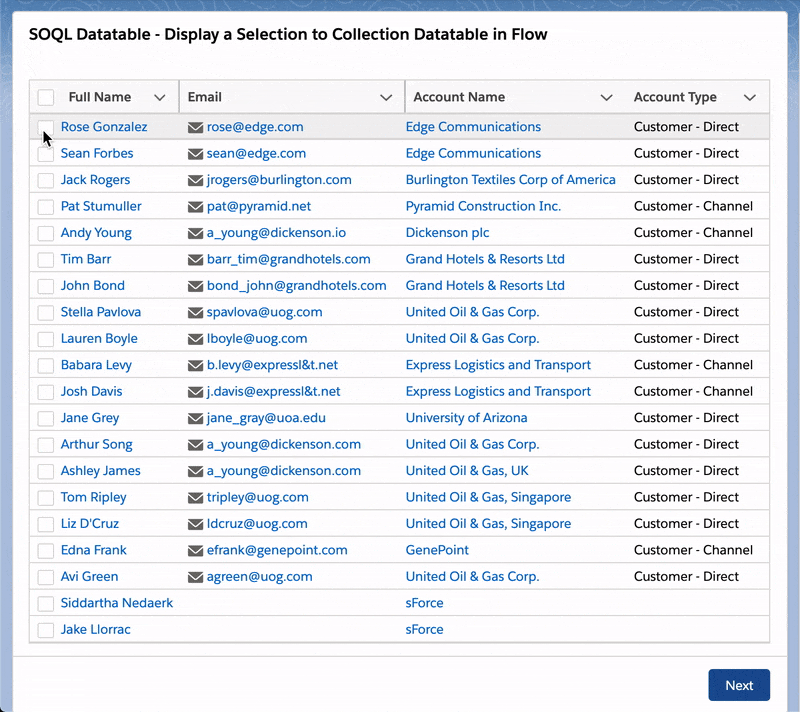
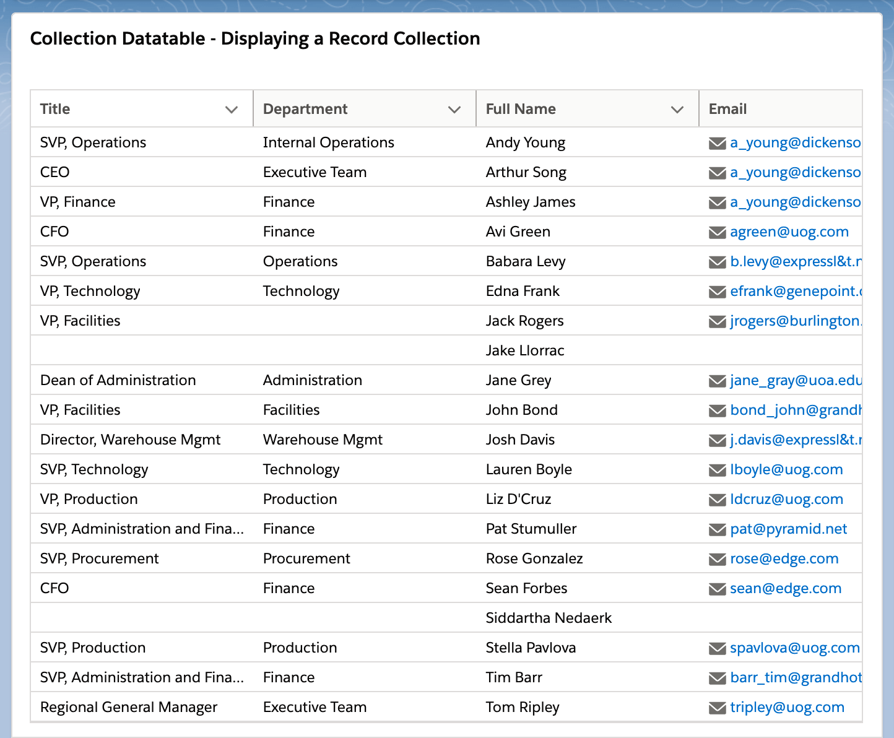
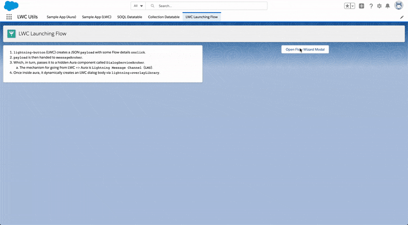

# LWC Utils and Design Patterns

This repo highlights the following production proven design patterns:

- Design custom LWC into a service component architecture, i.e. making "utils".
- Showcase complex datatable components like `SOQL Datatable` and `Collection Datatable` which can be used on App Flexipage, Record Flexipage, and even Flow Screens.
- Showcase a unified messaging platform for both aura and lwc via `messageService`.


## Install with SFDX

SFDX CLI and VSCode has matured enough for general usage so I will be moving my repo to SFDX format only.

For VSCode and SFDX setup see steps (1 and 2) from the [official lwc-recipes repo](https://github.com/trailheadapps/lwc-recipes#installing-recipes-using-salesforce-dx). Once you have the SFDX CLI set up and Authed into a Dev Hub you can then:

1) Clone this repo to a desired directory.

```
git clone https://github.com/tsalb/lwc-utils
```

2) Open VSCode (with a Dev Hub already connected), and open the `lwc-utils` folder.

3) Use [Command Palette](https://code.visualstudio.com/docs/getstarted/userinterface#_command-palette) to `SFDX: Create a Default Scratch Org` .

4) Use Command Palette to `SFDX: Push Source to Default Scratch Org`.

5) Use the `sfdx-cli` to assign a required permission set.

```
sfdx force:user:permset:assign -n LWC_Utils_Access
```

6) Use Command Palette to `SFDX: Open Default Org`.

## Install via Deploy to Salesforce

<a href="https://githubsfdeploy.herokuapp.com?owner=tsalb&repo=lwc-utils&ref=summer-20">
  
</a>

> **NOTE:** This button will deploy this current `summer-20` branch to a target sandbox ONLY if that sandbox is also on summer 20.

## Reusable Components used in lwc-utils

| Component Name         | Description                                                                                                                                                                                                                                                                                                                                                                                                                                                                                                                                       | Component Type                                        |
|------------------------|---------------------------------------------------------------------------------------------------------------------------------------------------------------------------------------------------------------------------------------------------------------------------------------------------------------------------------------------------------------------------------------------------------------------------------------------------------------------------------------------------------------------------------------------------|-------------------------------------------------------|
| `messageService`       | Unifies communication between Aura and LWC with a `Lightning Message Service` (LMS) to `OpenChannel__c`.<br><br>Use this component instead of manually subscribing / publishing to LMS.<br><br>Has a psuedo-namespacing property called `boundary` which can separate subscribers by string, `recordId` etc.<br><br>Subscribers can choose to listen to any event by just enabling event handling like:<br><br>LWC: `<c-messageService onmycoolevent={handleCoolEvent}>`<br><br>Aura: `<c:messageService onmycoolevent="{! c.handleCoolEvent }">` | LWC:<br>`Service`<br><br>[spec]()                     |
| `DialogService`        | Provides access to `lightning:overlayLibrary` to create dialogs (modals) via LMS                                                                                                                                                                                                                                                                                                                                                                                                                                                                  | Aura:<br>`Service`<br><br>[spec]()                    |
| `DialogServiceHandler` | Utility bar (empty label) component wrapping `messageService`.<br><br>Provides universal access to `DialogService` by handling the `opendialog` LMS event.                                                                                                                                                                                                                                                                                                                                                                                        | Aura:<br>`Service`, `Utility Bar`<br><br>[spec]()     |
| `eventFooter`          | Dynamic footer for lwc dialogs.<br><br>Contains an instance of `messageService` listening for the `closefooter` LMS Event.<br><br>Unfortunately, `component.getReference()` does not work on LWCs. Write your own action button in the dialog body.                                                                                                                                                                                                                                                                                               | Aura:<br>`UI`<br><br>[spec]()                         |
| `modalFooter`          | Dynamic footer for aura dialogs.<br><br>Connects a primary action on the target dialog body to the footer's main action via `component.getReference()`<br><br>Enables writing functions directly on the dialog body and `DialogService.modal()` will connect it to a primary action.                                                                                                                                                                                                                                                              | Aura:<br>`UI`<br><br>[spec]()                         |
| `FlowWrapper`          | Enables `DialogService` to create flows inside a dialog body dynamically.<br><br><br>Can be used with `dialogAutoCloser` (LWC flow component) to automatically close a dialog launched by this component.<br><br>See `flowWizardLauncherExample` (LWC).                                                                                                                                                                                                                                                                                           | Aura:<br>`Service`<br><br>[spec]()                    |
| `dialogAutoCloser`     | Contains a progress bar and timer message before automatically closing a `DialogService` dialog with the `closerfooter` LMS event                                                                                                                                                                                                                                                                                                                                                                                                                 | LWC:<br>`Service`, `Flow`<br><br>[spec]()             |
| `soqlDatatable`        | // TODO                                                                                                                                                                                                                                                                                                                                                                                                                                                                                                                                           | LWC:<br>`UI`, `App`, `Record`, `Flow`<br><br>[spec]() |
| `collectionDatatable`  | // TODO                                                                                                                                                                                                                                                                                                                                                                                                                                                                                                                                           | LWC `UI`, `Flow`<br><br>[spec]()                      |

## SOQL Datatable

This component can dynamically create tables from just a SOQL String fed into its design attributes in the App Builder. For example: 

```
SELECT Id, Name, Email, Phone, Account.Name, Account.BillingState, Account.Type FROM Contact
```


Clicking Edit Page on the App Page, you can see that there are only a handful of design attributes.


On a Record Flexipage you have access to a property called `isRecordBind` which will merge field in the `recordId` into the SOQL String like in the following examples:

```
SELECT Id, Name, Email, Phone FROM Contact WHERE AccountId = recordId

or

SELECT Id, Name FROM CustomObject__c WHERE Account__c IN (SELECT Id FROM Account WHERE Id = recordId)
```

## SOQL Datatable - Dynamic Creation via MessageService & DialogService

Dynamically create a `soqlDatatable` when clicking the `Launch a SOQL Datatable in a Dialog` button.

<p align="center">
    
</p>

This is the psuedo-code of what happens:

```
button.js calls messageService.dialogService(payload)
    => button.js composed instance of messageService uses LMS to...
        => Another composed instance of messageService in DialogServiceHandler.cmp (label-less in utility bar)
            =>  CustomEvent opendialog is bubbled and handled in...
                => DialogServiceHandler.cmp component.finds()...
                    => DialogService.cmp
                        => DialogServiceController.js
                            => $A.createComponent('c:soqlDatatable')
                                => lightning:overlayLibrary
```

Here's the actual payload used in the above code flow:

```js
handleOpenDialog() {
    const query = convertToSingleLineString`
        SELECT Title, Name, Email
        FROM Contact
        WHERE AccountId IN (SELECT Id FROM Account)
        LIMIT 5
    `;
    const dialogServicePayload = {
        method: 'bodyModalLarge',
        config: {
            auraId: 'soql-datatable-example',
            headerLabel: 'Dynamically Created SOQL Datatable',
            component: 'c:soqlDatatable',
            componentParams: {
                isRecordBind: false,
                recordId: this.recordId,
                queryString: query
            }
        }
    };
    this.template.querySelector('c-message-service').dialogService(dialogServicePayload);
}
```

As you can see, it's possible to parameterize a payload back to Aura's `$A.createComponent` API to instantiate a public properties against an LWC.

## SOQL Datatable - Display a Selection to Collection Datatable in Flow

This Screen Flow uses the ability for `SOQL Datatable` to output a `List<SObject>` directly in Flow.

Another component called `Collection Datatable` is able to display any Flow `Record Collection`.

<p align="center">
    
</p>
<p align="center">
    
</p>


## Collection Datatable - Displaying a Record Collection

This Screen Flow uses `Collection Datatable` as a standalone way to display the output of a `Get Record` node in flow.

<p align="center">
    
</p>
<p align="center">
    
</p>

## Combining SOQL and Collection Datatable with Flow inputs

```
// TODO description
```

<p align="center">
    
</p>

```
// TODO gif
```

## Collection Datatable - Using Apex Wrappers

```
// Future Roadmap
```

## Launch a flow from an LWC

In psuedo-code:

```
lightning-button creates a JSON payload with some Flow details onclick
    => payload is then handed to messageService
        => messageService passes it to a label-less (but rendered) Aura component in the utility bar called DialogServiceHandler
            => Once inside aura, it dynamically creates an LWC dialog body via lightning:overlayLibrary
```

Below is the actual flow this will be using:

<p align="center">
    
</p>

Which looks like this when clicked:

<p align="center">
    
</p>

To understand the mechanics of what is happening in the wizard itself, see the next section.

## Dynamic Templating in LWC Wizard Body, inside a flow

This flow in this example uses a single LWC to back multiple screens. In essence, this is using flow as a navigation tool for switching between various `template if:true` checks on the LWC itself.

In other words, `flowWizardRouter` is able to dynamically `render()` a chosen `template` based on an `@api` attribute.

```js
import { LightningElement, api, track } from 'lwc';
import { DateTime } from 'c/luxon';
// Known templates
import { default as dateParserMenu } from './templates/dateParserMenu.html';
import { default as defaultTemplate } from './templates/default.html';

export default class FlowWizardRouter extends LightningElement {
    @api templateName;
    @api
    get flowCacheJSON() {
        return JSON.stringify(this.flowCache);
    }
    set flowCacheJSON(value) {
        this.flowCache = JSON.parse(value);
    }

    ...

    render() {
        switch (this.templateName) {
            case 'dateParserMenu':
                return dateParserMenu;
            default:
                return defaultTemplate;
        }
    }

    ...

    get isDateParser() {
        return this.templateName === 'dateParserMenu';
    }

    get isDateParserOne() {
        return this.isDateParser && this.templateStep === 1;
    }

    get isDateParserTwo() {
        return this.isDateParser && this.templateStep === 2;
    }
}
```

While doing so, it leverages flow as a state storage:

```js
notifyFlow() {
    // The prop name needs to be the LWC one, not the variable name in flow itself
    // Also, manual variable assignment MUST be used for this to persist across screens
    this.dispatchEvent(new FlowAttributeChangeEvent('flowCacheJSON', JSON.stringify(this.flowCache)));
}
```

And on the selected template:

```html
<!-- flowWizardRouter/templates/dateParserMenu.html -->
<template if:true={isDateParserOne}>

    <!-- template to show when configured to one -->

</template>
<template if:true={isDateParserTwo}>

    <!-- template to show when configured to two -->

</template>
```


