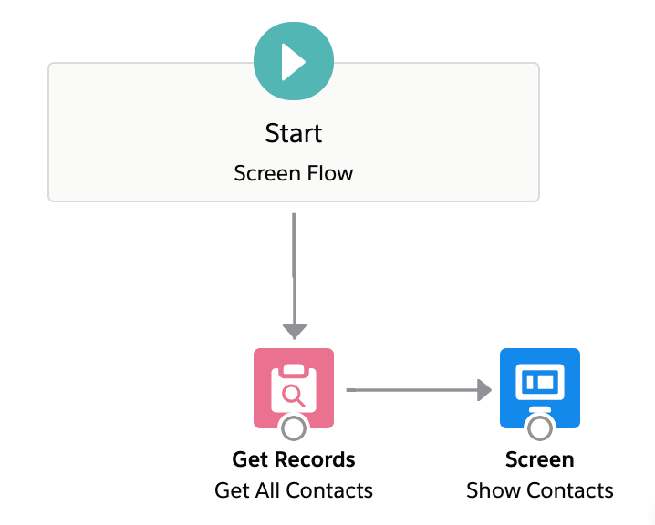
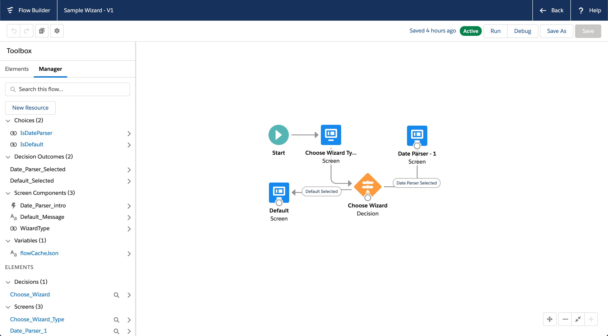

# LWC Utils and Design Patterns

This repo highlights the following production proven design patterns:

- Design custom LWC into a service component architecture, i.e. making "utils".
- Showcase complex datatable components like `SOQL Datatable` and `Collection Datatable` which can be used on App Flexipage, Record Flexipage, and even Flow Screens.
- Showcase `Lightning Message Channel` wrapped in a service component, `messageService`.


## Install with SFDX

SFDX CLI and VSCode has matured enough for general usage so I will be moving my repo to SFDX format only.

For VSCode and SFDX setup see steps (1 and 2) from the [official lwc-recipes repo](https://github.com/trailheadapps/lwc-recipes#installing-recipes-using-salesforce-dx). Once you have the SFDX CLI set up and Authed into a Dev Hub you can then:

1) Clone this repo to a desired directory.

```
git clone https://github.com/tsalb/lwc-utils
```

2) Open VSCode (with a Dev Hub already connected), and open the `lwc-utils` folder.

3) Use [Command Palette](https://code.visualstudio.com/docs/getstarted/userinterface#_command-palette) to `SFDX: Create a Default Scratch Org` .

4) Use Command Palette to `SFDX: Push Source to Default Scratch Org`.

5) Use the `sfdx-cli` to assign a required permission set.

```
sfdx force:user:permset:assign -n LWC_Utils_Access
```

6) Use Command Palette to `SFDX: Open Default Org`.

## Install via Deploy to Salesforce

<a href="https://githubsfdeploy.herokuapp.com?owner=tsalb&repo=lwc-utils&ref=summer-20">
  
</a>

> **NOTE:** This button will deploy this current `summer-20` branch to a target sandbox ONLY if that sandbox is also on summer 20.

## Aura Service Components

`DialogService.cmp` wraps Aura only APIs right now:
- `overlayLibrary` which is responsible for creating dialogs (modals)
- `workspaceApi` which is responsible for controlling service console tab/sub-tabs

This component is connected via `Lightning Message Service`.

## SOQL Datatable

This component can dynamically create tables from just a SOQL String fed into its design attributes in the App Builder. For example: 

```
SELECT Id, Name, Email, Phone, Account.Name, Account.BillingState, Account.Type FROM Contact
```


Clicking Edit Page on the App Page, you can see that there are only a handful of design attributes.


But that's not all, when used on a Record Flexipage, you have access to a property called `isRecordBind` which will merge field in the `recordId` into the SOQL String like in the following examples:

```
SELECT Id, Name, Email, Phone FROM Contact WHERE AccountId = recordId

or

SELECT Id, Name FROM CustomObject__c WHERE Account__c IN (SELECT Id FROM Account WHERE Id = recordId)
```

If that's not flexible enough, you can access this component directly from LWC and do something like in `Launch a SOQL Datatable in a Dialog` which dynamically creates a `soqlDatatable` on the fly!

## SOQL Datatable - Dynamic Creation via MessageBroker

This example uses `DialogService` to dynamically create a LWC on the fly when the `Launch a SOQL Datatable in a Dialog` button is clicked:


In psuedo-code for the `messageBroker`:

1) `lightning-button` creates a JSON payload with some `lightning:overlayLibrary` details `onclick`.
    - Yes, that API is an `Aura` one!
2) JSON payload passes through `Lightning Message Channel`, eventually, to `overlayLibrary`.
3) The full payload path is: 
    ```
    button.js 
        => messageBroker.js 
            => LMS 
                => messageBrokerHandler.js (LWC in DialogServiceBroker.cmp - yes Aura) 
                    => onmessage (bubbled CustomEvent)
                        => DialogServiceBrokerController.js 
                            => DialogService.cmp
                                => DialogServiceController.js
                                    => $A.createComponent('c:soqlDatatable')
                                        => lightning:overlayLibrary
    ```

Yep, it's possible to parameterize the payload (eventually) back to Aura's `$A.createComponent` API to instantiate a public properties against a LWC!

And here's the actual payload used in the above code flow:

```js
handleOpenDialog() {
    const query = convertToSingleLineString`
        SELECT Title, Name, Email
        FROM Contact
        WHERE AccountId IN (SELECT Id FROM Account)
        LIMIT 5
    `;
    const dialogServicePayload = {
        method: 'bodyModalLarge',
        config: {
            auraId: 'soql-datatable-example',
            headerLabel: 'Dynamically Created SOQL Datatable',
            component: 'c:soqlDatatable',
            componentParams: {
                isRecordBind: false,
                recordId: this.recordId,
                queryString: query
            }
        }
    };
    this.template.querySelector('c-message-broker').dialogService(dialogServicePayload);
}
```

If you've read this far, you might be connecting the dots that `DialogService`, an `Aura` component, is completely capable of creating any LWC on the fly and putting it into a modal / dialog!

## SOQL Datatable - Display a Selection to Collection Datatable in Flow

This Screen Flow uses the ability for `SOQL Datatable` to output a `List<SObject>` directly in Flow.

Another component called `Collection Datatable` is able to display any Flow `Record Collection`.

<p align="center">
    
</p>


## Collection Datatable - Displaying a Record Collection

This Screen Flow uses `Collection Datatable` as a standalone way to display the output of a `Get Record` node in flow.

<p align="center">
    
</p>


## Combining SOQL and Collection Datatable with Flow inputs

```
// TODO description
```

<p align="center">
    
</p>

```
// TODO gif
```

## Collection Datatable - Using Apex Wrappers

```
// Future Roadmap
```

## Launch a flow from an LWC

Leverages both `MessageBroker` and `DialogService` to dynamically start flows from an LWC.

This simple example brokers a payload to `lightning:flow` (Aura only in Summer 19) to start a flow with a given `flowName` and `inputVariables`.

In psuedo-code:

1) `lightning-button` creates a JSON payload with some Flow details `onclick`.
2) payload is then handed to `messageBroker`.
3) Which, in turn, passes it to a hidden Aura component called `DialogServiceBroker`.
4) The mechanism for going from LWC => Aura is `Lightning Message Channel` (aka `LMS`).
5) Once inside aura, `DialogServiceBroker` dynamically creates an LWC dialog body via `lightning:overlayLibrary` (yes, back in Aura).

Below is the actual flow this will be using:

<p align="center">
    
</p>

Which looks like this when clicked:


To understand the mechanics of what is happening in the wizard itself, see the next section.

## Dynamic Templating in LWC Wizard Body, inside a flow

This flow in this example uses a single LWC to back multiple screens. In essence, this is using flow as a navigation tool for switching between various `template if:true` checks on the LWC itself.

In other words, `flowWizardRouter` is able to dynamically `render()` a chosen `template` based on an `@api` attribute.

```js
import { LightningElement, api, track } from 'lwc';
import { DateTime } from 'c/luxon';
// Known templates
import { default as dateParserMenu } from './templates/dateParserMenu.html';
import { default as defaultTemplate } from './templates/default.html';

export default class FlowWizardRouter extends LightningElement {
    @api templateName;
    @api
    get flowCacheJSON() {
        return JSON.stringify(this.flowCache);
    }
    set flowCacheJSON(value) {
        this.flowCache = JSON.parse(value);
    }

    ...

    render() {
        switch (this.templateName) {
            case 'dateParserMenu':
                return dateParserMenu;
            default:
                return defaultTemplate;
        }
    }

    ...

    get isDateParser() {
        return this.templateName === 'dateParserMenu';
    }

    get isDateParserOne() {
        return this.isDateParser && this.templateStep === 1;
    }

    get isDateParserTwo() {
        return this.isDateParser && this.templateStep === 2;
    }
}
```

While doing so, it leverages flow as a state storage:

```js
notifyFlow() {
    // The prop name needs to be the LWC one, not the variable name in flow itself
    // Also, manual variable assignment MUST be used for this to persist across screens
    this.dispatchEvent(new FlowAttributeChangeEvent('flowCacheJSON', JSON.stringify(this.flowCache)));
}
```

And on the selected template:

```html
<!-- flowWizardRouter/templates/dateParserMenu.html -->
<template if:true={isDateParserOne}>

    <!-- template to show when configured to one -->

</template>
<template if:true={isDateParserTwo}>

    <!-- template to show when configured to two -->

</template>
```


